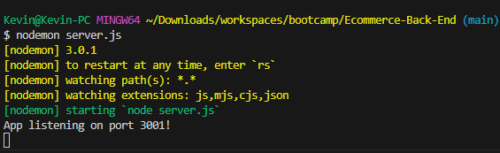
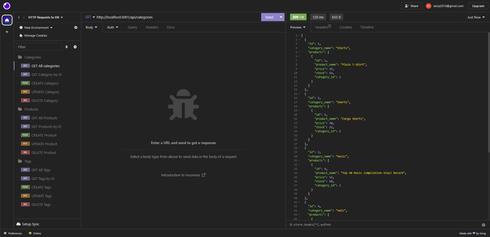

# Ecommerce Back End

## Description

A lot of companies need an ecommerce back-end in order to display information about their numerous products. This back end application is a demonstration of how a simple ecommerce website uses a database in order to display the information for users to shop. This app uses express as a server hosting package and sequelize as an ORM. I learned how to make a many-to-many relationship through sequelize as well as its many other ORM capabilities.

## Installation

Use `npm i` to install all required modules

## Usage

Enter your MySQL credentials and the database name " into a `.env` file within the root folder, then run `node server.js` in a node environment, or run `nodemon server.js` with the nodemon package to easily make modifications. Since there is no front end, you may use Insomnia or a similar program to make HTTP requests to the server to make CRUD commands to the database.

[Link to video preview]()

## Credits

N/A

## License

N/A